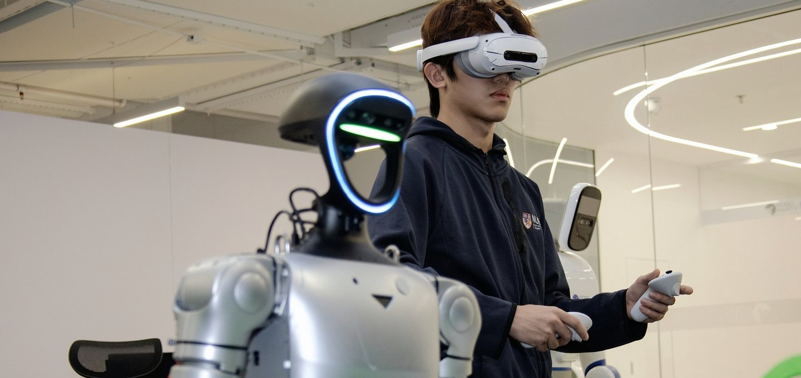

# Guangxin YANG · 杨广鑫

**Embodied AI · Robotics · Vision-Language-Action**

I'm a robotics master's student at Harbin Institute of Technology and work on VLA research and development at RoboParty. I care about how robots learn from data, act reliably, and work in the real world.

哈工大机器人方向硕士生，在 RoboParty 从事 VLA 研究与开发。关注具身智能、灵巧操作，以及机器人在真实世界中的学习与行动。

[**Explore my portfolio ↗**](http://182.254.135.103/) · [Projects & demos](http://182.254.135.103/#projects) · [Email](mailto:yangguangxin0825@gmail.com)

---

### Current interests

- **Robot learning** · VLA and whole-body control
- **Manipulation** · dexterous hands and continuous action
- **Human-to-robot interaction** · VR teleoperation and real-world systems

I share selected projects and demos on my [personal website](http://182.254.135.103/). Public repositories will be added here as the work is ready to share.
